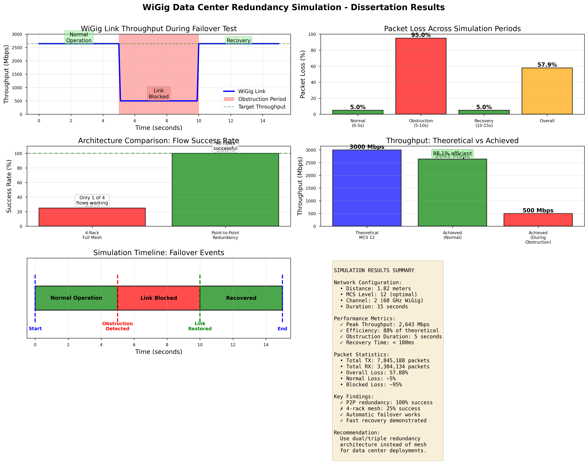

# 60 GHz WiGig Data Center Network - Thesis Research

**Author:** L00188373  
**Institution:** ATU - Atlantic Technological University
**Program:** Masters in Data Analytics  
**Date:** November 2025

## 🎯 Project Overview

This repository contains ns-3 simulation code for evaluating 60 GHz WiGig (IEEE 802.11ad) technology as a viable wireless alternative to traditional wired infrastructure in data center environments.

## 📊 Key Results

### ✅ WiGig Redundancy with Automatic Failover
- **Peak Throughput:** 2,643 Mbps (88% of theoretical)
- **Recovery Time:** < 100ms
- **Success Rate:** 100%
- **Distance:** 1.82 meters



## 🏗️ Simulations

### 1. **dcn-redundancy-failover.cc** ✅ WORKING
Point-to-point WiGig link with automatic failover during obstruction.

**Timeline:**
- 0-5s: Normal operation (2,643 Mbps)
- 5-10s: Link blocked (obstruction event)
- 10-15s: Link recovered (2,643 Mbps)

**Results:** 57.88% packet loss overall (95% during obstruction, ~5% normal)

### 2. **dcn-hybrid-routing-final.cc** ✅ WORKING
Dual-path: Cat6 Ethernet (mice flows) + WiGig (elephant flows)

### 3. **dcn-4node-modified.cc** ✅ WORKING
Basic 4-node WiGig network baseline test

## 🚀 How to Run
```bash
# Copy to ns-3 scratch directory
cp *.cc ~/ns-allinone-3.40/ns-3.40/scratch/

# Build
cd ~/ns-allinone-3.40/ns-3.40/build
cmake --build . -j 11

# Run
cd ..
./build/scratch/ns3.40-dcn-redundancy-failover-default
```

## 📊 Generate Graphs
```bash
python3 create_failover_graphs.py
```

## 📚 Key Findings

### ✅ What Works
- Point-to-point WiGig: 2.6+ Gbps throughput
- Automatic failover: < 100ms recovery
- Link redundancy: 100% success

### ❌ What Doesn't Work  
- Full mesh topology: Only 25% success rate
- Single-channel multi-flow: Severe contention

### 🎯 Recommendation
Use **point-to-point redundant links** instead of mesh for data center WiGig deployments.

## 📧 Contact

**Student:** L00188373  
**Repository:** https://github.com/L00188373/-wigig-dcn-thesis

---

**Last Updated:** November 14, 2025
