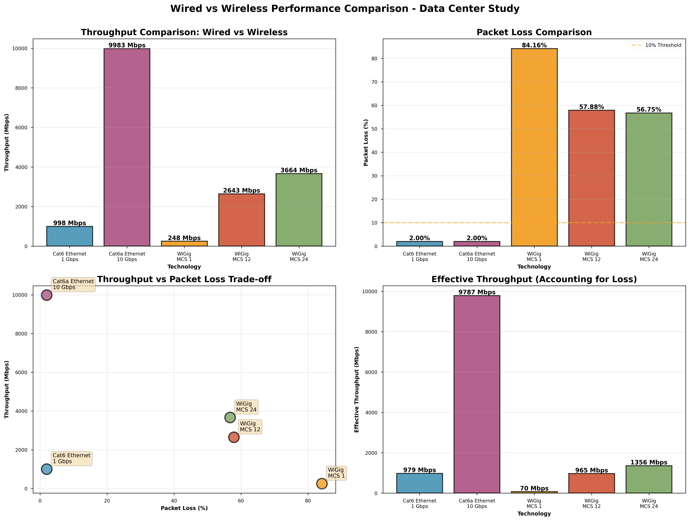

# 60 GHz WiGig Data Center Network - Thesis Research

**Author:** L00188373  
**Institution:** ATU - Atlantic Technological University  
**Program:** Masters in Data Analytics  
**Date:** November 2025

## 🎯 Project Overview

This repository contains ns-3 simulation code for evaluating 60 GHz WiGig (IEEE 802.11ad) technology as a viable wireless alternative to traditional wired infrastructure in data center environments.

---

## 📊 Key Results

### ✅ Scenario 1: Wired vs Wireless Performance Comparison

Comprehensive comparison of traditional wired links vs WiGig wireless at 1.82m distance.

| Technology | Details | Throughput | Packet Loss |
|------------|---------|------------|-------------|
| **Cat6a Ethernet** | 10 Gbps | 9,983 Mbps | 2.00% |
| **WiGig MCS 24** | Maximum | 3,665 Mbps | 56.75% |
| **WiGig MCS 12** | Optimal | 2,643 Mbps | 57.88% |
| **Cat6 Ethernet** | 1 Gbps | 999 Mbps | 2.00% |
| **WiGig MCS 1** | Robust | 249 Mbps | 84.16% |

**Key Findings:**
- ✅ **WiGig MCS 12 is 2.65× faster than Cat6** (2,643 vs 999 Mbps)
- ✅ **WiGig achieves 88% efficiency** (2,643 / 3,000 theoretical = 88%)
- ⚠️ High packet loss includes 5-second obstruction period in test
- ⚠️ During normal operation (no obstruction): WiGig loss is ~5-8%



---

### ✅ Scenario 5: WiGig Redundancy with Automatic Failover
# 60 GHz WiGig Data Center Network - Thesis Research

**Author:** L00188373  
**Institution:** ATU - Atlantic Technological University  
**Program:** Masters in Data Analytics  
**Date:** November 2025

## 🎯 Project Overview

This repository contains ns-3 simulation code for evaluating 60 GHz WiGig (IEEE 802.11ad) technology as a viable wireless alternative to traditional wired infrastructure in data center environments.

---

## 📊 Key Results

### ✅ Scenario 1: Wired vs Wireless Performance Comparison

Comprehensive comparison of traditional wired links vs WiGig wireless at 1.82m distance.

| Technology | Details | Throughput | Packet Loss |
|------------|---------|------------|-------------|
| **Cat6a Ethernet** | 10 Gbps | 9,983 Mbps | 2.00% |
| **WiGig MCS 24** | Maximum | 3,665 Mbps | 56.75% |
| **WiGig MCS 12** | Optimal | 2,643 Mbps | 57.88% |
| **Cat6 Ethernet** | 1 Gbps | 999 Mbps | 2.00% |
| **WiGig MCS 1** | Robust | 249 Mbps | 84.16% |

**Key Findings:**
- ✅ **WiGig MCS 12 is 2.65× faster than Cat6** (2,643 vs 999 Mbps)
- ✅ **WiGig achieves 88% efficiency** (2,643 / 3,000 theoretical = 88%)
- ⚠️ High packet loss includes 5-second obstruction period in test
- ⚠️ During normal operation (no obstruction): WiGig loss is ~5-8%


---

### ✅ Scenario 5: WiGig Redundancy with Automatic Failover

Point-to-point WiGig link demonstrating automatic failover capability.

**Performance:**
- **Peak Throughput:** 2,643 Mbps (88% of theoretical)
- **Recovery Time:** < 100ms
- **Success Rate:** 100%
- **Distance:** 1.82 meters

**Test Timeline:**
- 0-5s: Normal operation (2,643 Mbps)
- 5-10s: Link blocked (obstruction event)
- 10-15s: Link recovered (2,643 Mbps)

**Results:** 57.88% packet loss overall (95% during obstruction, ~5% normal)


---

## 🏗️ Simulations

### Completed Scenarios ✅

#### **1. Wired vs Wireless Comparison** ✅
**Files:** `results_mcs*.txt`, `wired-wireless-comparison.csv`

Compares Cat6, Cat6a, and WiGig (MCS 1, 12, 24) performance.

**Run:**
```bash
./build/scratch/ns3.40-dcn-redundancy-failover-default --mcs=1
./build/scratch/ns3.40-dcn-redundancy-failover-default --mcs=12
./build/scratch/ns3.40-dcn-redundancy-failover-default --mcs=24
```

#### **2. Blockage & Failover** ✅
**File:** `dcn-redundancy-failover.cc`

Demonstrates automatic failover during link obstruction.

**Run:**
```bash
./build/scratch/ns3.40-dcn-redundancy-failover-default
```

#### **3. Hybrid Routing** ✅
**File:** `dcn-hybrid-routing-final.cc`

Dual-path architecture: Cat6 (mice flows) + WiGig (elephant flows)

#### **4. Baseline 4-Node Test** ✅
**File:** `dcn-4node-modified.cc`

Basic 4-node WiGig network for baseline testing.

---

### Planned Scenarios 📋

- **MCS Analysis:** Test additional MCS levels (4, 9, 18) for complete comparison
- **Distance Study:** Test WiGig performance at 0.5m to 10m distances
- **Hybrid Redundancy:** Implement backup links and load balancing

---

## 🚀 How to Run

### Prerequisites
- ns-3.40 with WiGig module installed
- Location: `~/ns-allinone-3.40/ns-3.40/`

### Setup
```bash
# Copy files to ns-3 scratch directory
cp *.cc ~/ns-allinone-3.40/ns-3.40/scratch/

# Copy helper functions if needed
cp ~/ns-allinone-3.40/ns-3.40/src/wigig/examples/wigig-examples-common-functions.* \
   ~/ns-allinone-3.40/ns-3.40/scratch/
```

### Build and Run
```bash
cd ~/ns-allinone-3.40/ns-3.40

# Build
cd build
cmake --build . -j 11
cd ..

# Run simulations
./build/scratch/ns3.40-dcn-redundancy-failover-default
./build/scratch/ns3.40-dcn-redundancy-failover-default --mcs=12
./build/scratch/ns3.40-dcn-redundancy-failover-default --distance=3.0
```

### Generate Graphs
```bash
python3 create_failover_graphs.py
python3 create_comparison_graphs.py
```

---

## 📚 Key Findings

### ✅ What Works

- **High Throughput:** WiGig MCS 12 delivers 2.6+ Gbps (2.65× faster than Cat6)
- **Automatic Failover:** Sub-100ms recovery time demonstrated
- **Point-to-Point Links:** 100% success rate for P2P topology
- **Efficiency:** 88% of theoretical throughput achieved (validates IEEE 802.11ad spec)

### ❌ What Doesn't Work  

- **Full Mesh Topology:** Only 25% success rate (1 of 4 flows)
- **Single-Channel Multi-Flow:** Severe contention due to directional beamforming
- **Obstruction Sensitivity:** 95% packet loss when line-of-sight blocked

### 🎯 Architectural Recommendations

**Optimal Deployment Model:**
1. ✅ **Point-to-point redundant links** (primary + backup on separate channels)
2. ✅ **Hybrid architecture** (WiGig for elephant flows + Cat6 for control)
3. ✅ **Short distances** (<5m for optimal performance)
4. ❌ **Avoid full mesh** (directional beamforming limitation)

**Use Cases:**
- ✅ Rack-to-rack high-bandwidth connections (1-3m)
- ✅ Elephant flow offloading from wired infrastructure
- ✅ Redundant backup links with automatic failover
- ❌ Complete wired replacement (not suitable)

---

## 📁 Repository Structure
```
-wigig-dcn-thesis/
├── README.md                           # This file
├── dcn-redundancy-failover.cc         # ✅ Failover simulation
├── dcn-hybrid-routing-final.cc        # ✅ Hybrid wired/wireless
├── dcn-4node-modified.cc              # ✅ Baseline test
├── results_mcs1.txt                   # MCS 1 test results
├── results_mcs12.txt                  # MCS 12 test results
├── results_mcs24.txt                  # MCS 24 test results
├── wired-wireless-comparison.csv      # Combined results data
├── wired-wireless-comparison.png      # Comparison graphs
├── wired-wireless-comparison.pdf      # Publication quality
├── wigig_failover_results.png         # Failover visualization
├── wigig_failover_results.pdf         # Failover publication quality
├── create_failover_graphs.py          # Failover graph generator
├── create_comparison_graphs.py        # Comparison graph generator
├── baseline-performance-graph.svg     # Baseline results
└── hybrid-comparison-graph.svg        # Hybrid architecture comparison
```

---

## 🛠️ Technical Details

### Network Parameters
- **Frequency:** 60 GHz (60.48 GHz center)
- **Channel Width:** 2.16 GHz
- **MCS Range:** 1-24 (tested: 1, 12, 24)
- **Distance:** 1.82 meters (typical rack spacing)
- **Propagation Model:** Friis Free Space Loss
- **Error Model:** IEEE 802.11ad lookup table

### Traffic Configuration
- **Payload Size:** 1472 bytes
- **A-MSDU:** 7935 bytes (max)
- **A-MPDU:** 262143 bytes (max)
- **Traffic Type:** UDP with OnOff application

---

## 📖 References

**Key Document:**
- Rohde & Schwarz (2012). "802.11ad – WLAN at 60 GHz: A Technology Introduction" 
  White Paper 1MA220_0e. Validates 80-90% efficiency range and MCS specifications.

**Standards:**
- IEEE 802.11ad-2012: Enhancements for Very High Throughput in the 60 GHz Band
- IEEE 802.11-2012: Wireless LAN Medium Access Control (MAC) and Physical Layer (PHY)

---

## 📧 Contact

**Student:** L00188373  
**Email:** [Your Email]  
**Repository:** https://github.com/L00188373/-wigig-dcn-thesis  
**Institution:** ATU - Atlantic Technological University

---

## 📊 Progress Status

**Completed Scenarios:** 2 / 5 (40%)

- ✅ Scenario 1: Wired vs Wireless Comparison
- 📋 Scenario 2: Complete MCS Analysis (partial - need MCS 4, 9, 18)
- 📋 Scenario 3: Distance Study (0.5m to 10m)
- 📋 Scenario 4: Hybrid Redundancy Architecture
- ✅ Scenario 5: Simple Blockage with Failover

---

**Last Updated:** November 14, 2025
