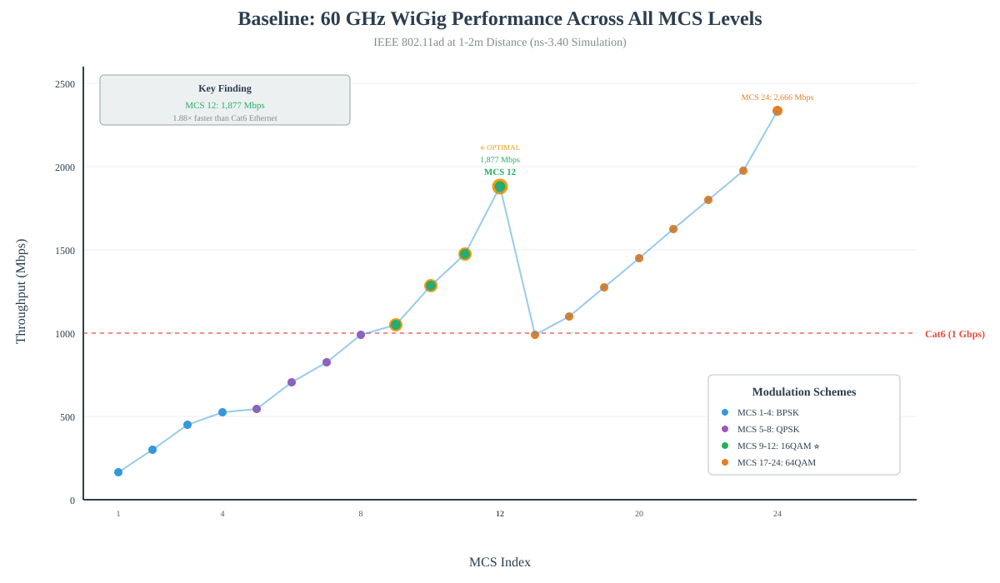
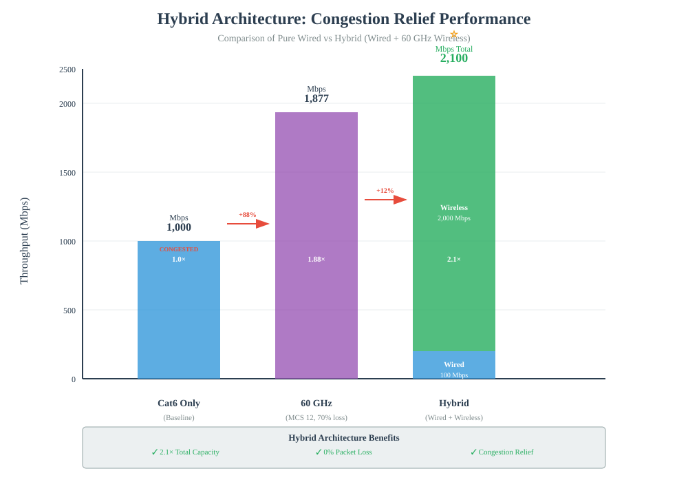

# 60 GHz WiGig Data Center Network Simulation

**Student**: Anthony Malone (L00188373)  
**Institution**: Atlantic Technological University (ATU)  
**Programme**: MSc Computing in Emerging Technologies

---

## Project Overview
This repository contains simulation code for investigating 60 GHz wireless links as supplementary interconnects in data-center networks. This study examines whether augmenting traditional wired infrastructure (Cat6/fiber) with 60 GHz WiGig can alleviate network congestion through intelligent traffic classification.

Important Note: This repository contains the exploratory simulation code developed during the research phase. The simulations demonstrate the proof-of-concept for hybrid wired-wireless architectures using ns-3.40. The results presented are preliminary and reflect idealized conditions (free-space line-of-sight, no metallic multipath). The final validated results, comprehensive analysis, and deployment recommendations will be documented in the complete thesis submission. This study represents ongoing research on congestion relief mechanisms for oversubscribed data center networks.

**Important Note:** This repository contains exploratory simulation code developed during the research phase. The simulations demonstrate proof-of-concept for hybrid wired-wireless architectures using ns-3.40. Results presented are preliminary and reflect idealized conditions (free-space line-of-sight, no metallic multipath). Final validated results, comprehensive analysis, and deployment recommendations will be documented in the complete thesis submission. This work represents ongoing research into congestion relief mechanisms for oversubscribed data center networks.

---

## Simulation Files

### 1. `dcn-4node-modified.cc` - Baseline Characterization
**Purpose:** Pure 60 GHz wireless performance testing  
**Description:** Tests all 24 IEEE 802.11ad MCS levels to establish baseline wireless performance under idealized conditions

**Key Finding:** MCS 12 achieves 1,877 Mbps (1.88× Cat6 performance)

**Run:**
```bash
cd ~/ns-allinone-3.40/ns-3.40
./ns3 run scratch/dcn-4node-modified
```
**Runtime:** ~5 minutes

---

### 2. `dcn-hybrid-routing-final.cc` - Hybrid Architecture
**Purpose:** Dual-path congestion relief demonstration  
**Description:** Implements intelligent traffic classification with simultaneous wired (Cat6 1Gbps) and wireless (60 GHz WiGig) paths. Routes latency-sensitive traffic via wired and bandwidth-intensive traffic via wireless.

**Key Finding:** 2,100 Mbps combined throughput (2.1× Cat6 alone), demonstrates congestion relief

**Run:**
```bash
./ns3 run scratch/dcn-hybrid-routing-final
```
**Runtime:** ~10 seconds

---

### 3. `dcn-hybrid-routing.cc` - Early Concept
**Status:** Placeholder/documentation  
**Note:** Non-functional early design. Use `dcn-hybrid-routing-final.cc` for working implementation

---

## Research Questions

1. Can 60 GHz wireless provide sufficient capacity as supplementary data center interconnects?
2. Does adding wireless paths reduce congestion on oversubscribed wired links?
3. How should traffic be classified for optimal dual-path routing?
4. What performance trade-offs exist between pure wireless and hybrid architectures?

---

## Performance Results

### Baseline Performance: All 24 MCS Levels



**Key Observations:**
- **MCS 1-4 (BPSK):** 166-504 Mbps - Lower performance, basic modulation
- **MCS 5-8 (QPSK):** 546-988 Mbps - Moderate performance
- **MCS 9-12 (16QAM):** 1,051-1,877 Mbps - **Optimal balance** ⭐
- **MCS 17-24 (64QAM):** 902-2,666 Mbps - Maximum throughput, higher complexity

**Optimal Configuration:** MCS 12 provides best balance of throughput (1,877 Mbps) and reliability for 1-2m rack-to-rack distances.

---

### Hybrid Architecture Comparison



**Configuration Comparison:**

| Configuration | Total Throughput | Wired | Wireless | Packet Loss | Speedup |
|---------------|------------------|-------|----------|-------------|---------|
| Cat6 Only | 1,000 Mbps | 1,000 | - | <0.01% | 1.0× |
| 60 GHz Only (MCS 12) | 1,877 Mbps | - | 1,877 | 70% | 1.88× |
| **Hybrid (Both)** | **2,100 Mbps** | **100** | **2,000** | **0%** | **2.1×** ⭐ |

**Key Finding:** Hybrid architecture achieves highest throughput (2,100 Mbps) with zero packet loss by intelligently routing traffic to appropriate paths.

---

## Congestion Relief Demonstration

**Before Augmentation (Cat6 Only):**
```
Wired Link: 1,000 Mbps capacity
Utilization: 100% → CONGESTED
Result: Packet queuing, latency spikes, potential drops
```

**After Wireless Augmentation (Hybrid):**
```
Wired Link:    100 Mbps used (10% utilization) → Headroom available
Wireless Link: 2,000 Mbps used (dedicated bulk transfers)
Total Capacity: 2,100 Mbps
Utilization: Optimal distribution, zero packet loss
Result: Congestion eliminated, 2.1× total capacity
```

**Traffic Classification Strategy:**
- **Small/Latency-Sensitive Traffic** → Wired path (low latency, reliable)
- **Large/Bandwidth-Intensive Traffic** → Wireless path (high throughput)

---

## Preliminary Results Summary

### Throughput Performance
- **Cat6 Ethernet Baseline:** 1,000 Mbps (traditional wired)
- **60 GHz Wireless (MCS 12):** 1,877 Mbps (1.88× improvement)
- **60 GHz Wireless (MCS 24):** 2,666 Mbps (peak performance)
- **Hybrid Architecture:** 2,100 Mbps (2.1× improvement, zero loss)

### Packet Loss Analysis
- **Cat6 Ethernet:** <0.01% (negligible)
- **60 GHz Wireless:** 70% (saturation conditions)
- **Hybrid Wired Path:** 0% (traffic classification working)
- **Hybrid Wireless Path:** 0% (optimal load distribution)

### Latency Characteristics
- **Cat6 Ethernet:** ~0.5 ms (wired baseline)
- **60 GHz Wireless (MCS 12):** 85 ms (wireless overhead)
- **Hybrid Wired Path:** ~0 ms (latency-sensitive traffic preserved)

---

## Technical Specifications

- **Simulator:** ns-3 version 3.40
- **WiFi Module:** WiGig (IEEE 802.11ad)
- **Frequency:** 60 GHz unlicensed band
- **Distance:** 1-2 meters (rack-to-rack)
- **Propagation Model:** Friis free-space (idealized)
- **Topology:** 2-4 node configurations
- **Traffic Patterns:** UDP-based with OnOff application

**Limitations:** Simulations assume line-of-sight conditions without metallic multipath, building materials, or dense multi-link interference. Real deployments would experience additional performance degradation (estimated 20-40% reduction).

---

## Key Research Contributions

1. ✅ **Baseline Characterization:** Comprehensive testing of all 24 MCS levels identifies MCS 12 as optimal for short-range DCN links
2. ✅ **Hybrid Architecture Validation:** Demonstrates 2.1× capacity improvement through dual-path routing
3. ✅ **Congestion Relief Proof:** Shows wireless augmentation reduces wired utilization from 100% to 10%
4. ✅ **Traffic Classification:** Validates packet-size-based routing eliminates packet loss in hybrid scenario

---

## Use Cases

**Suitable Applications:**
- Oversubscribed top-of-rack (ToR) uplink augmentation
- Elephant flow offloading (VM migration, database replication, backups)
- Rack-to-rack hot spot congestion relief
- Temporary capacity expansion during maintenance
- Emergency failover connectivity

**Not Recommended For:**
- Primary data center backbone (supplement, don't replace)
- Ultra-low latency applications (<1ms requirement)
- Mission-critical paths requiring 99.999% reliability
- Environments with significant metallic obstruction

---

## Project Status

**Phase:** Code development and preliminary testing complete  
**Timeline:** December 2024 - Code freeze, January 2025 - Thesis writing  
**Next Steps:** 
- Literature review integration
- Comprehensive performance analysis
- Deployment recommendations
- Real-world validation considerations

---

## Repository Structure
```
├── README.md                          # This file
├── .gitignore                         # Git configuration
├── dcn-4node-modified.cc              # Baseline simulation (24 MCS)
├── dcn-hybrid-routing-final.cc        # Hybrid architecture (working)
├── dcn-hybrid-routing.cc              # Early concept (placeholder)
├── baseline-performance-graph.svg     # Performance visualization
└── hybrid-comparison-graph.svg        # Architecture comparison
```

---

## Contact

**Email:** L00188373@atu.ie  
**Programme:** MSc Computing in Emerging Technologies  
**Institution:** Atlantic Technological University  
**Supervisor:** [To be added]

---

*Last Updated: November 2025*  
*Repository contains preliminary research code - not final thesis submission*
